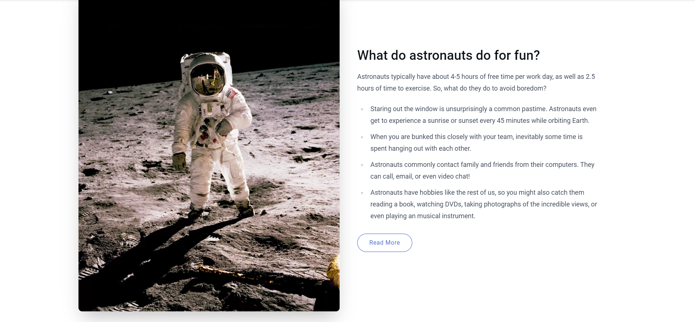

# Frontend Coding Challenge

## Setup

Please fork this GitHub project for you and send us the link of your version as soon as you're done.

## Task

You are provided with a Figma mockup for creating an *image-text-section* component that should be
implemented in Next.js (React) with the content out of the Storyblok API. You can do the implementation either in
JavaScript or TypeScript, depending on your preference. For styling, however, Tailwind CSS should be used.

Make sure to display all the data you see in the mockup which can be retrieved from the API you see in the
section below. If you can't access the JSON data through the API call, you can find the output in the JSON file
*output.json* in this project.

*Side note: The already existing components Feature, Grid, Page and Teaser in the src/components folder are
automatically generated during the creation of a Next/Storyblok project and are only there for demonstration purposes,
so they don't have to be used and can therefore be seen as irrelevant for processing this challenge. A short tutorial on
how to add a headless CMS to Next.js can be
found [here](https://www.storyblok.com/tp/add-a-headless-cms-to-next-js-in-5-minutes).*

### Further information about the *image-text-section* in Storyblok

If you don't have a Storyblok account, this is how the *image-text-section* block is built and configured:

#### Fields

##### *Text*

* headline (field type: Text)
* text (field type: Richtext)
* button (field type: Blocks)

##### *Image*

* image (field type: Asset)
* image_layout (field type: Single-Option)

##### *Style (not required for implementation)*

* reverse_layout (field type: Boolean)
* background_color (field type: Single-Option)

#### Config

* Technical name: image-text-section
* Display name: Image Text Section
* Block type: Nestable block

## Design

The design is provided via
Figma: https://www.figma.com/file/i6yH5MiA0swrvORR0Vzo4G/Coding-Challenge?node-id=1%3A55&t=IOFQD6TVvTFpw4Au-1

## Links & API

* Slug of the demo page: coding-challenge

* Public token of the Storyblok space: 7AYvqGn4sJQV8tWRrG4g7Att

* REST API (JSON): https://api.storyblok.com/v2/cdn/stories/coding-challenge?cv=1682689636&token=7FmwGeMV2rQLGkGafUByDAtt&version=published

* Documentation for the Storyblok API
  connection: https://www.storyblok.com/docs/api/content-delivery/v2#topics/introduction

## Development

First, run `npm install` to install all the node modules necessary for this project.

To run the development server, use one of the following:

```
npm run dev
# or
pnpm dev
```

Open [http://localhost:3000](http://localhost:3000) with your browser to see the result.

### Setting up a dev server with HTTPS proxy (required by Storyblok preview)

Install *mkcert* to create a valid certificate: https://github.com/FiloSottile/mkcert

Running the proxy to target port 3000, you can change that to any port of your choice, but it should be what your app is
running on in development.

```
npm install -g local-ssl-proxy
```

```
local-ssl-proxy --source 3010 --target 3000 --cert localhost.pem --key localhost-key.pem
```

The local page you see your implementation in can then be accessed here: https://localhost:3010/coding-challenge

## Storyblok Demo

This is the element (*image-text-section* component) from the Storyblok demo frontend based on Next.js



The full demo page can be found here: https://storyblok-demo-default.vercel.app/

## Disclaimer

Limit your invested time to a maximum of 1 hour. You don't need to be finished when you reach this time limit since it's
rather short.

Please also provide us with a description of how you tackled this task and what challenges you faced.

We want to evaluate how you work and what your process is, so don't worry if you cannot provide a perfect solution.
